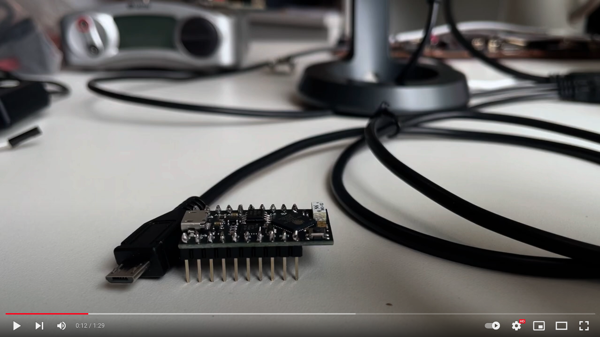

# EmSys 2021 Autumn: Lab 1 

__Intro video__
<p align="center">
        <a href="http://www.youtube.com/watch?feature=player_embedded&v=7sfWQOsEM9c
        " target="_blank"></a>
</p>

In this lab you will use the logic analyser to decode the secret word that the preloaded program running on your TinyPico is emitting via one of the GPIO pins on your TinyPico boards.
Here are some hints about the signal:

* It is being emitted via a ``UART`` protocol.
* The baudrate is either ``115200`` or ``9600``
* It is being emitted on one of these pins ``23,19,18.5,22,21,32,33,25,26,27,15,14,4``

__Your job is to figure out what the secret word is being emitted from your device__ 

In your lab pairs GitHub repository (see submission guide below) I would like you to state:
* What your secret word is
* The pin number where the secret word is being emitted on
* What the baudrate is

I would also like you to include a screenshot of pulseview showing that you have decoded the secret word.

----------------------------------
__WARNING:__ when testing out your lab setup you may want to try reprogramming your device with Arduino. This will overwrite the program emitting a secret word from your device. Your hardware kit should contain two devices both will be emitting the secret word. You can use one device to test out Arduino and keep one with the original program. If you do overwrite the program on both your TinyPicos don't worry, just bring them into one of the lab sessions and I will reupload the secret message code.  

----------------------------------
### Setting up your lab environment

Make sure that you follow the video tutorials for setting up lab environment on your home machine [[here](https://github.com/STFleming/EmSys_labSetup)].

### Using PulseView & your logic analyser

* Using PulseView to capture a signal [[video](https://www.youtube.com/watch?v=nhTuqYAT4OI)]
* Using PulseView to decode a UART signal [[video](https://www.youtube.com/watch?v=hBrg0VJTNWA)]


----------------------------------
## Submission guide

Assessment will consist of both code submissions and a logbook for the lab, written in markdown format. You will use git to manage and submit your logbook, and each group will have a private GitHub repository created for them. Don't worry if you are unfamiliar with git, we will be using basic features.

* A good guide on ```git``` can be found here [[link](https://www.freecodecamp.org/news/learn-the-basics-of-git-in-under-10-minutes-da548267cc91/)].
* If you need to install git, please follow the instructions [[here](https://git-scm.com/book/en/v2/Getting-Started-Installing-Git)].

An example of what your empty logbook repository will look like can be found [[here](https://github.com/STFleming/EmSys_Example_Lab1_logbook)]. When you get an email with your repository, use the following commands to get access to it:

```
        git clone <LINK TO YOUR PRIVATE LOGBOOK REPOSITORY>
```

The bulk of the text of your logbook will be contained in ```README.md``` in the top-level directory of your private repository. You will add your answers and discuss the ab in this document using a markup language called markdown. A useful guide for markdown can be found [[here](https://guides.github.com/features/mastering-markdown/)]. 

Say you answer a question in the ``README.md`` of your private repository. Now you need to save the changes. Type the following commands to push your changes to GitHub.

```
        git add README.md
        git commit -m "some text describing the changes you've made"
        git push
```
The commands above will then push the changes that you have made to the GitHub repository. Don't worry about making mistakes here; you can push further changes to your answers, only the final submission will be marked. This is the very basics of git, a better tutorial can be found [[here](https://www.freecodecamp.org/news/learn-the-basics-of-git-in-under-10-minutes-da548267cc91/)].

__For this lab I would like you to do the following__
* Edit ``lab1/README.md`` in your lab group repository to say: 
	* The secret word you found
	* The pin that the secret word was being emitted on
	* The baudrate it was being emitted at
* Include a screenshot ``lab1/screenshot.png`` that shows the signal decoded on pulseview.

----------------------------------
